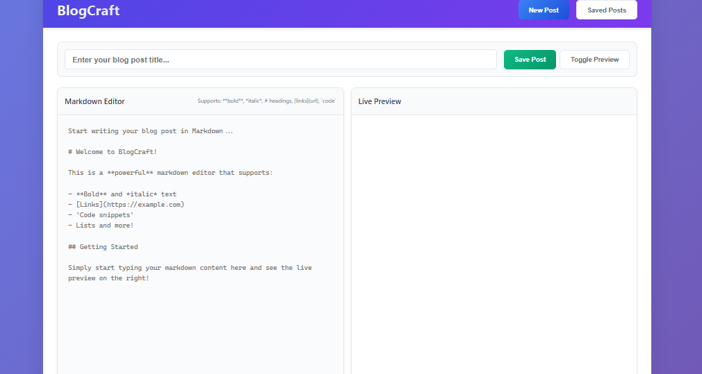

# 📝 BlogCraft - Markdown Blog Editor

BlogCraft is a simple and elegant markdown-based blog editor and post manager. It allows users to write, preview, save, edit, and delete markdown blog posts right in the browser using localStorage.

## 🔗 Live Demo

Try the live version here:  
👉 [BlogCraft Live Demo](https://Deenprasath.github.io/blog-website/)  

## 🚀 Features

- Live Markdown Preview
- Create, Edit, and Delete Posts
- Saved Posts Listing
- Responsive UI with Preview Toggle
- Toast Notifications for User Feedback
- Keyboard Shortcuts (`Ctrl + S` to save, `Ctrl + N` to start new)

## 🛠️ Tech Stack

- HTML, CSS (Responsive UI with Flex/Grid)
- JavaScript (Vanilla)
- LocalStorage for persistent post data
- [Marked.js](https://github.com/markedjs/marked) for Markdown rendering

## 📁 Folder Structure
├── index.html # Main HTML file
├── style.css # Stylesheet for the UI
├── main.js # Blog editor logic
└── README.md # You're here!

